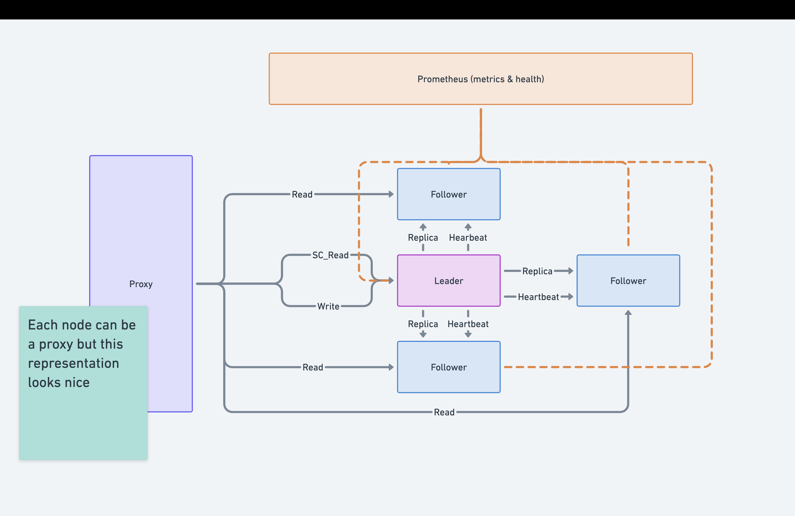
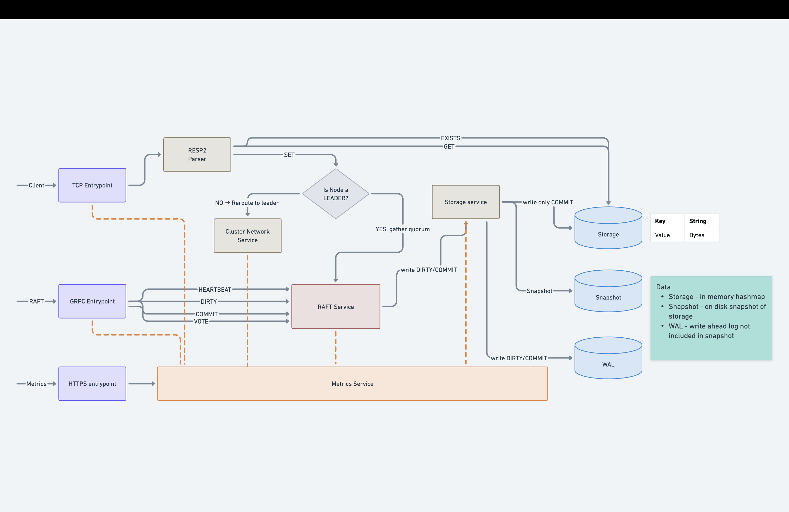

# Simple Distributed Redis

A learning-focused implementation of a distributed key-value store inspired by Redis, built to understand distributed systems concepts including consensus algorithms, replication, and fault tolerance.

## 🎯 Project Goals

- **Learn distributed systems**: Implement Raft consensus, replication, and sharding from scratch
- **Redis compatibility**: Support redis-cli and basic Redis commands
- **Clean architecture**: Simple, maintainable code that can evolve without major refactors
- **Comprehensive testing**: Unit, integration, and chaos tests for correctness

## ✨ Features

### Currently Implemented
- ✅ RESP2 protocol parser and renderer
- ✅ Generic storage interface with in-memory implementation
- ✅ Operation parsing framework
- ✅ Comprehensive unit tests
- ✅ Write-Ahead Log (WAL) for durability
- ✅ Snapshot mechanism for faster recovery
- ✅ TCP server with RESP2 protocol

### Planned Features
- 🔜 Raft consensus algorithm
- 🔜 Distributed cluster with replication
- 🔜 Consistent hashing for sharding
- 🔜 Dynamic service discovery (optional)
- 🔜 Pub/Sub messaging (optional)
- 🔜 Docker deployment

## 🏗️ Architecture

Here is the high-level planned architecture of one shard/node cluster in the distributed system:



Here is the high-level architecture of the node components:




## 🚀 Quick Start

### Prerequisites
- Go 1.23+ (for rangefunctions experimental support)
- redis-cli (optional, for testing)

### Installation

```bash
# Clone the repository
git clone https://github.com/poneciak57/simple-distributed-redis.git
cd simple-distributed-redis

# Install dependencies
go mod download

# Run tests
make test

# Build the binary
make build
```

### Running (docker)
TBD


## 📚 Documentation

- **[Roadmap](docs/roadmap.md)**: Development phases and current progress
- **[Raft Algorithm](docs/raft.md)**: Explanation of Raft consensus algorithm and edge cases
- TBD

## 🧪 Testing

```bash
# Run all tests
make test
```

### Redis-cli compatibility
You can use `redis-cli` to interact with the server once it's running. Hovewer note that
it is not intended for production use. This is just for learning purposes and support might be limited to more
than just RESP2 protocol compatibility. I tested basic commands like `SET`, `GET`, `DEL`, `PING`, etc.


## 🛠️ Development

### Project Structure
TBD

### Development Roadmap

**Phase 1: Foundation**
- [x] RESP2 protocol
- [x] Storage interface
- [x] WAL implementation

**Phase 2: Single Node**
- [x] TCP server
- [x] Command execution
- [ ] Health checks

**Phase 3: Consensus**
- [ ] Raft implementation
- [ ] Leader election
- [ ] Log replication

**Phase 4: Distribution**
- [ ] Consistent hashing
- [ ] Node communication (gRPC)
- [ ] Data replication

See [roadmap.md](docs/roadmap.md) for detailed progress.

## 🔧 Configuration
Configuration is done via `config/default.yaml`.
TBD: Add details about configuration options.


## 🎓 Learning Resources

This project is built for learning. Here are key resources:

- **Raft**: [The Raft Paper](https://raft.github.io/raft.pdf)
- **Redis Protocol**: [RESP2 Specification](https://redis.io/docs/latest/develop/reference/protocol-spec/)
- **Consistent Hashing**: [Wikipedia Article](https://en.wikipedia.org/wiki/Consistent_hashing)
- **Distributed Systems**: [MIT 6.824](https://pdos.csail.mit.edu/6.824/)

## 📝 License

MIT License - See LICENSE file for details

## 🙏 Acknowledgments

- Redis team for the excellent protocol, inspiration and documentation
- Raft authors for making consensus understandable
- Go team for a great language for distributed systems
